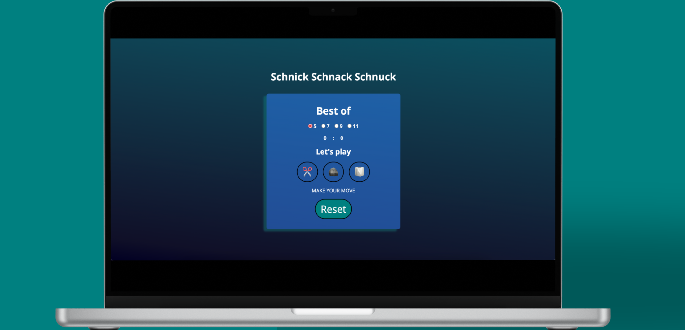

# Schere Stein Papier
Willkommen zu unserem Schere Stein Papier Spiel!

# Demo
https://game-schere-stein-papier.netlify.app/

# Spielregeln
Das Spiel folgt den klassischen Regeln von Schere, Stein, Papier:

✂️ schlägt 🧻
🪨 schlägt ✂️
🧻 schlägt 🪨

# Author
- [@philipkuerzel](https://github.com/philipkuerzel)
- [@JohannaHaer](https://github.com/JohannaHaer)

# Mockups
Rundenauswahl

Spielstand
